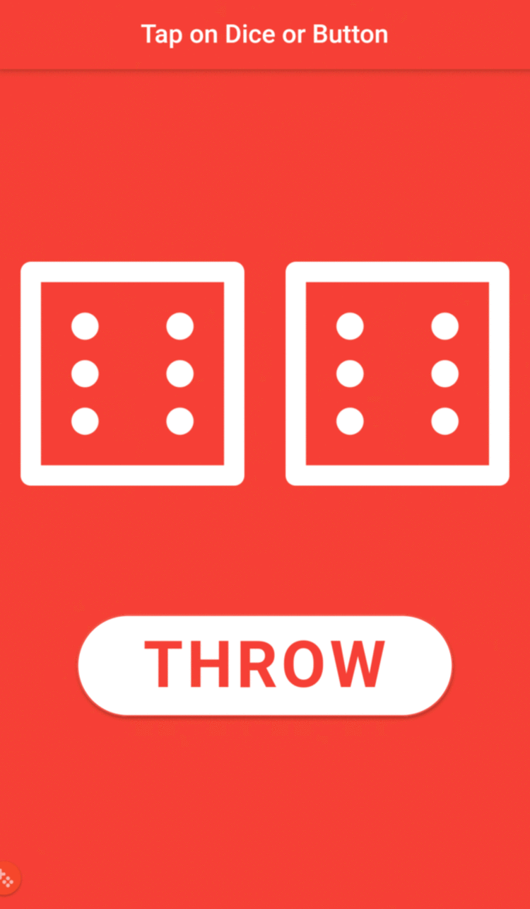

# Dicee 🎲

## Motive

A Las Vegas dice app. You can make the die roll at the press of a button. With this app in your pocket, you’ll be able to settle any score on the go!

## Here's a view of the final app

## Note

I made this app as a companion when undertaking flutter fundamentals course from LinkedIn Learning. The course link is: [Flutter: Part 04 Building an App with State](https://www.linkedin.com/learning/flutter-part-04-building-an-app-with-state). If you're interested, have a go.

## Intended to learn

- How to use Flutter stateless widgets to design the user interface.
- How to use Flutter stateful widgets to update the user interface.
- How to change the properties of various widgets.
- How to use onPressed listeners to detect when buttons are pressed.
- How to use setState to mark the widget tree as dirty and requiring update on the next render.
- How to use Expanded to make widgets adapt to screen dimensions.
- Understand and use string interpolation.
- Learn about basic dart programming concepts such as data types and functions.
- Code and use gesture controls.
